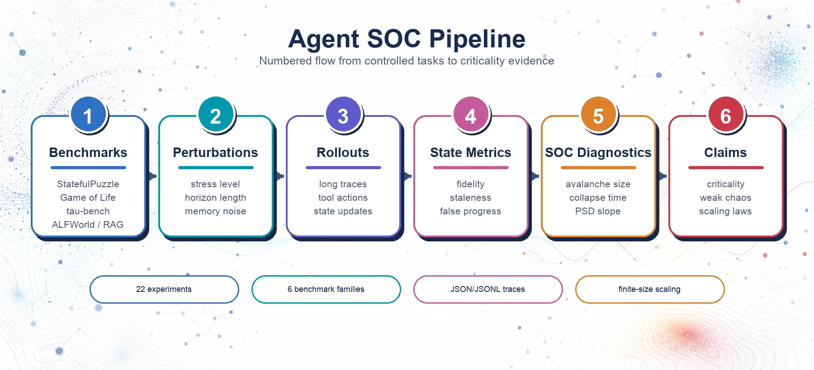

<h1 align="center">World Model Science</h1>

<p align="center">
  <strong>Self-Organized Criticality in Long-Horizon Agents</strong>
</p>

<p align="center">
  <a href="LICENSE"></a>
  <a href="pyproject.toml"></a>
</p>

<p align="center">
  
</p>

Official code release for **World Model Science: Self-Organized Criticality, Weak Chaos, and Metastable Belief Dynamics in Long-Horizon LLM Agents**.

Conference paper under review.

This repository studies whether long-horizon agent failures behave like
self-organized-criticality (SOC) phenomena: small local perturbations can
accumulate into avalanches, collapse times, weak chaos, metastable belief
dynamics, and scale-sensitive failure geometry.

## At a Glance

- **Research question.** Do long-horizon agent failures exhibit self-organized criticality rather than independent error accumulation?
- **Core idea.** The pipeline measures avalanche-like failure statistics across synthetic tasks and external agent benchmarks.
- **What is included.** Controlled SOC experiments, benchmark wrappers, LLM configuration, reproduction scripts, and reported key results.

## Pipeline

<p align="center">
  
</p>

## Key Contributions

- **22 controlled experiments** spanning synthetic, tool-use, RAG, and embodied-agent settings.
- **6 benchmark families**: StatefulPuzzle-SOC, Game of Life prediction, tau-bench Retail/Airline, ALFWorld, GAIA, and HotpotQA-RAG.
- **SOC-style measurements**: avalanche size, collapse time, stress response, spectral slope, fractal dimension, local-global gap, weak-chaos sensitivity, and finite-size scaling.
- **Provider-neutral LLM interface**: public configuration uses generic endpoint/model/key variables and does not require a provider-specific API name in the docs.

## Quick Start

```bash
git clone git@github.com:Hik289/agent-self-organized-criticality.git
cd agent-self-organized-criticality

python -m venv .venv
source .venv/bin/activate
pip install -r requirements.txt
pip install -e .

cp .env.example .env
```

Fill in `.env`, then export the variables in your shell:

```bash
export LLM_API_BASE_URL="https://YOUR_LLM_API_BASE_URL/v1"
export LLM_MODEL="YOUR_MODEL_NAME"
export LLM_API_KEY="YOUR_LLM_API_KEY"
```

Run a smoke-sized version of a single experiment:

```bash
cd experiments/wave2a/exp_1_1
python run.py --n 2
```

Each experiment writes results into its own directory:

- `results.json`: per-trajectory outputs and metrics
- `aggregates.json`: aggregate statistics
- `summary.json`: run metadata
- `run.log`: progress log

## LLM Configuration

The code expects a chat-completions-compatible client. The public release uses
generic environment variables:

```bash
LLM_API_BASE_URL=https://YOUR_LLM_API_BASE_URL/v1
LLM_MODEL=YOUR_MODEL_NAME
LLM_API_KEY=YOUR_LLM_API_KEY
```

The wrapper files are intentionally lightweight and can be adapted to any
compatible backend. Real credentials should stay local and should never be
committed.

## Repository Structure

```text
.
├── README.md
├── LICENSE
├── CITATION.cff
├── citation.bib
├── requirements.txt
├── assets/
│   ├── agent-soc-overview.webp
│   └── agent-soc-pipeline.webp
├── lib/
│   ├── wave2a/        # StatefulPuzzle-SOC + Game of Life utilities
│   ├── wave2b/        # tau-bench utilities
│   └── wave2c/        # ALFWorld / GAIA / HotpotQA utilities
└── experiments/
    ├── wave2a/        # synthetic memory, GoL, spectral, weak-chaos tests
    ├── wave2b/        # tau-bench Retail/Airline experiments
    └── wave2c/        # embodied, RAG, and GAIA experiments
```

The `experiments/wave2*/lib` links point to the corresponding root `lib/wave2*`
folders so that each experiment remains runnable from inside its own directory.

## Experiments

| Wave | Scope | Representative Questions |
|---|---|---|
| Wave 2a | StatefulPuzzle-SOC and Game of Life | Do stress, memory corruption, horizon, and grid size induce collapse, avalanches, weak chaos, or finite-size scaling? |
| Wave 2b | tau-bench Retail/Airline | Do tool-use agents show local-global gaps, escape dynamics, stress accumulation, and universality classes? |
| Wave 2c | ALFWorld, GAIA, HotpotQA-RAG | Do embodied and retrieval agents show metastability, surface stability, fractal error geometry, and near-critical regimes? |

Run all experiments in a wave:

```bash
for exp in experiments/wave2a/exp_*/; do
  echo "Running $exp"
  (cd "$exp" && python run.py)
done
```

Analogously replace `wave2a` with `wave2b` or `wave2c`.

## Benchmarks

| Benchmark | Setup |
|---|---|
| StatefulPuzzle-SOC | Self-contained |
| Game of Life | Self-contained |
| tau-bench | Clone the benchmark repository and set the local path expected by the relevant experiment |
| ALFWorld | Install the benchmark package and download its data |
| GAIA | Download the Level-1 split metadata and files |
| HotpotQA-RAG | Downloaded through the dataset utilities used by the runner |

The synthetic benchmarks are included for controlled SOC-style interventions;
external benchmarks are used for tool-use, retrieval, and embodied-agent stress
tests.

## Reproducibility

The experiments are designed as controlled dynamical probes rather than
leaderboard-style performance comparisons.

- Deterministic decoding is used throughout.
- The default random seed is `42`.
- Single-seed runs are intentional: the focus is on macro-level dynamical
  signatures and controlled perturbation curves.
- Output JSON files are saved next to each experiment script to make downstream
  aggregation and plotting straightforward.

## Citation

If this repository is useful for your work, please cite:

```bibtex
@misc{worldmodelsoc2026,
  title        = {World Model Science: Self-Organized Criticality, Weak Chaos, and Metastable Belief Dynamics in Long-Horizon LLM Agents},
  author       = {Anonymous Authors},
  year         = {2026},
  note         = {Conference paper under review},
  howpublished = {\url{https://github.com/Hik289/agent-self-organized-criticality}}
}
```

The same entry is available in [`citation.bib`](citation.bib), and GitHub's
citation panel can read [`CITATION.cff`](CITATION.cff).

## License

This project is released under the MIT License. See [`LICENSE`](LICENSE).
